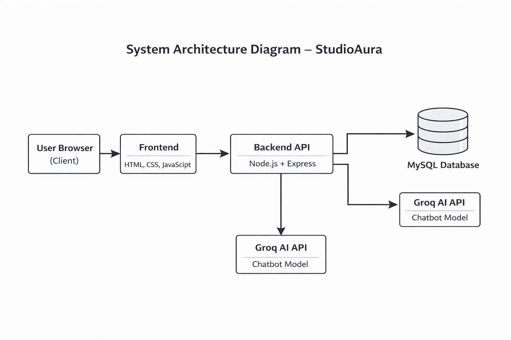
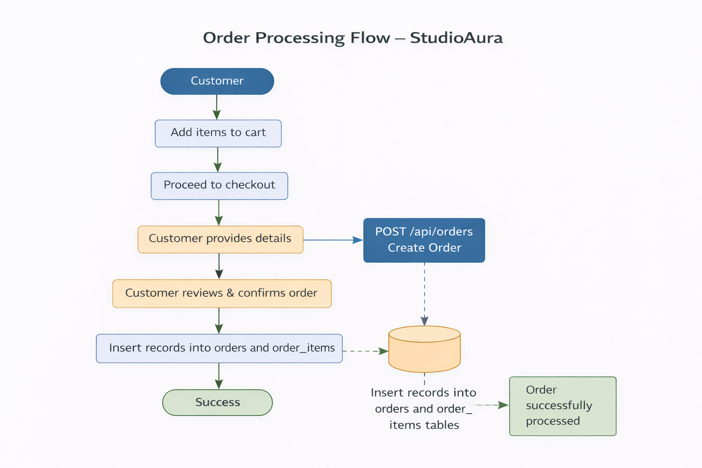
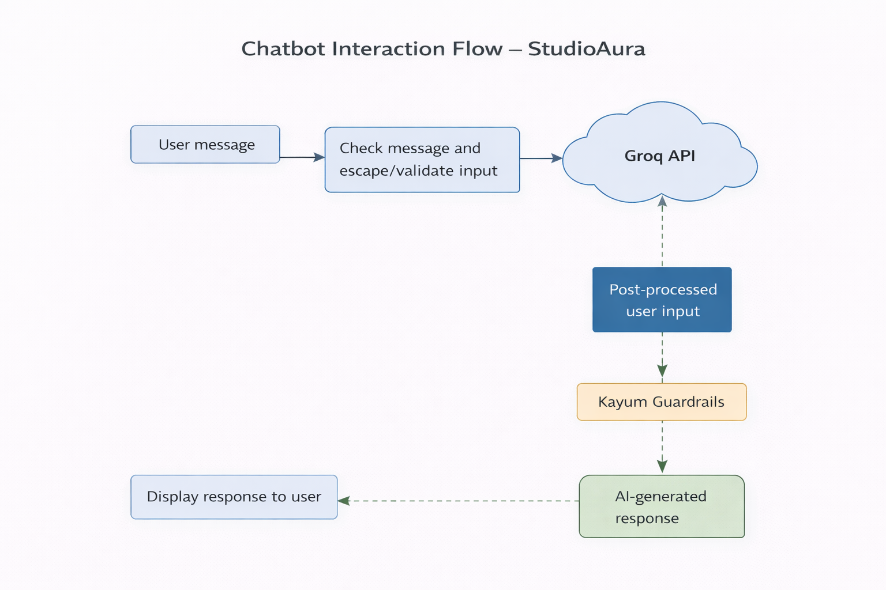
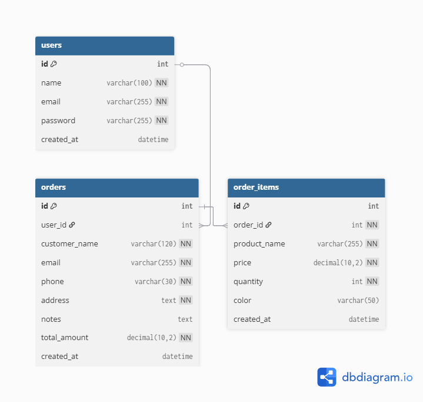

StudioAura

Interior Design & Handcrafted Crafts Web Application

1. Project Overview

StudioAura is a full-stack web application designed to represent an interior design studio while also providing an online platform for selling handcrafted wooden furniture and décor items. The system enables users to browse interior design services, explore portfolios, purchase products, and interact with an AI-powered assistant for guidance and inquiries.

This project was developed as part of an academic course to demonstrate practical understanding of frontend development, backend API design, database management, authentication mechanisms, and AI integration.

2. Project Proposal
2.1 Project Title

StudioAura – Interior Design & Handcrafted Crafts Platform

2.2 Problem Statement

Many small interior design studios and craft businesses lack a unified digital platform that effectively showcases their services, portfolios, and products while also providing interactive customer support. This project addresses that problem by offering a single, integrated web-based solution.

2.3 Objectives

To design a responsive and user-friendly web interface.

To implement user authentication and secure order handling.

To store and manage user and order data using a relational database.

To integrate an AI chatbot that assists users without providing incorrect information.

To demonstrate end-to-end full-stack web development skills.

2.4 Scope

The system supports customer-side functionality, including browsing products and services, placing orders, and communicating through the chatbot. Administrative features are limited to backend data storage and management for academic simplicity.

3. Technology Stack
3.1 Frontend Technologies

HTML5

CSS3 with responsive design principles

JavaScript using Vanilla JS

Font Awesome Icons

3.2 Backend Technologies

Node.js

Express.js

3.3 Database

MySQL

3.4 Security and Authentication

bcrypt for password hashing

Local storage for session handling

3.5 AI Integration

Groq API for chatbot functionality

Strict prompt rules to prevent hallucination

4. System Architecture

The system follows a client–server architecture where the frontend communicates with a backend API. The backend processes authentication requests, manages orders, interacts with the MySQL database, and communicates with the AI service.

5. Authentication Workflow

Users are required to register and log in before accessing protected features such as the checkout process. The authentication workflow includes credential validation, password hashing using bcrypt, and session handling.

6. Product Ordering and Checkout Flow

This flow describes how users add products to the cart, proceed to checkout, submit order details, and how the backend stores order and order item data in the database.

7. Chatbot Interaction Flow

The chatbot interaction flow explains how user messages are sent from the frontend to the backend, processed using predefined rules, forwarded to the AI model, and returned as responses to the user.

8. Database Design

The database design follows a relational model with clearly defined entities and relationships.

8.1 Users Entity

The users entity stores registered user information. It includes a unique identifier, user name, email address, and a securely hashed password.

8.2 Orders Entity

The orders entity stores order-level information, including a unique order identifier, customer name, email address, phone number, shipping address, optional notes, and the total order amount.

8.3 Order Items Entity

The order items entity stores individual product details associated with each order. It includes a unique identifier, a reference to the related order, product name, price, quantity, and selected color.

9. User Interface Pages

Home Page

Shop Page for Craft Products

Interior Design Services Page

Portfolio Page

Contact Page

Checkout Page

Login and Registration Modal

Cart Modal

AI Chatbot Widget

10. How to Run the Project

Clone the repository using the command:
git clone https://github.com/your-username/studioaura.git

Install the required backend dependencies using:
npm install

Create a .env file and add the following entry:
GROQ_API_KEY=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

Start the backend server using:
node server.js

Open index.html in a web browser to access the application.

11. Learning Outcomes

Understanding of full-stack web application development.

Experience with RESTful API creation and integration.

Practical knowledge of relational database design.

Implementation of authentication and security practices.

Frontend state management techniques.

Integration of AI systems with controlled constraints.

Application of responsive UI and UX design principles.

12. Conclusion

StudioAura successfully demonstrates a complete full-stack web application that integrates frontend design, backend services, database management, and AI-driven assistance. The project adheres to standard software engineering practices and fulfills academic requirements while reflecting real-world application design principles.
